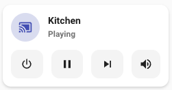
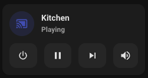

# Media Player card

## Description

A media player card allow you to control a media player entity.

## Configuration variables

All the options are available in the lovelace editor but you can use `yaml` if you want.

| Name                | Type    | Default     | Description                                                                            |
| :------------------ | :------ | :---------- | :------------------------------------------------------------------------------------- |
| `entity`            | string  | Required    | Media Player entity                                                                    |
| `icon`              | string  | Optional    | Custom icon                                                                            |
| `name`              | string  | Optional    | Custom name                                                                            |
| `layout`            | string  | Optional    | Layout of the card. Vertical, horizontal and default layout are supported              |
| `use_media_info`    | boolean | `[]`        | Use media info instead of name, state and icon when a media is playing                 |
| `use_media_artwork` | boolean | `[]`        | Use media artwork instead of icon when a media is playing                              |
| `media_controls`    | list    | `[]`        | List of controls to display (on_off, shuffle, previous, play_pause_stop, next, repeat) |
| `volume_controls`   | list    | `[]`        | List of controls to display (volume_mute, volume_set, volume_buttons)                  |
| `tap_action`        | action  | `more-info` | Home assistant action to perform on tap                                                |
| `hold_action`       | action  | `more-info` | Home assistant action to perform on hold                                               |
| `double_tap_action` | action  | `more-info` | Home assistant action to perform on double_tap                                         |
